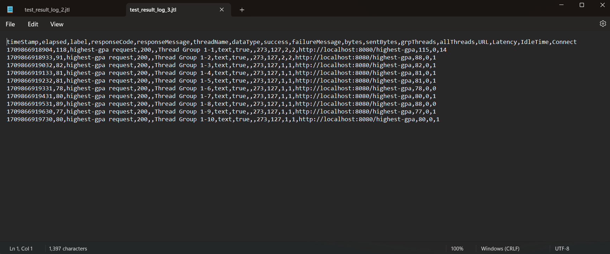

# Reflection

See More Screenshot

## Ini adalah hasil JMeter yang menggunakan GUI untuk mengecek `all-student-name`

## Ini adalah hasil JMeter yang menggunakan GUI untuk mengecek `highest-gpa`

## Ini adalah hasil JMeter yang menggunakan CLI untuk mengecek `all-student-name`

## Ini adalah hasil JMeter yang menggunakan CLI untuk mengecek `highest-gpa`

## Ini adalah hasil JMeter yang menggunakan CLI untuk mengecek `all-student` Sebelum dan Sesudah Profiling

### Sebelum Profiling

### Sesudah Profiling

## Ini adalah hasil JMeter yang menggunakan CLI untuk mengecek `all-student-name` dan `highest-gpa` Sesudah Profiling

Perhatikan bahwa setelah profiling, _elapsed time_-nya berkurang.

See More Reflection

Saya lebih menyukai melakukan _profiling_ dengan menggunakan JMeter. Hal ini karena saya tidak perlu memasukkan url yang saya tuju ke browser saya. Hal ini sangat mempermudah karena kita tinggal menunggu saja untuk _profiling_-nya untuk jalan dan kemudian kita dapat langsung melihat hasilnya pada notepad. Kemudian, hasilnya bisa kita bandingkan dengan melihat 2 file notepad yang berbeda. Menurut saya, cara seperti ini lebih mudah dengan cara yang ditawarkan oleh _IntelliJ Profiler_ karena informasi yang ada pada _IntelliJ Profiler_ terlalu banyak. Contohnya adalah ketika kita melakukan search sederhana, tiba-tiba yang muncul adalah kelas bawaan java yang tidak ingin saya ubah. Hal ini menurut saya cukup berbahaya.

Saya dapat mengetahui apakah ada sebuah method yang perlu diperbaiki. Dengan pengalaman, menurut saya, saya akan lebih tau berapa lamakah waktu yang _reasonable_ untuk sebuah method berjalan. Jika sebuah method berjalan dengan jangka waktu yang cukup lama, menurut saya hal tersebut bisa diperbaiki. Identifikasi bisa dibuat dengan menggunakan _profiler_ yang ada yang kemudian kita bandingkan hasilnya dengan apa yang kita harapkan _reasonable_ untuk menjadi waktu _elapsed time_. Hal ini membuat kita sebagai _programmer_ tau bagian mana yang bisa diperbaiki _performance_-nya pada kode yang telah kita buat.

Menurut saya, tergantung dilihat dari sisi mana. Menurut saya, ada terlalu banyak informasi yang muncul pada _IntelliJ Profiler_. Sebagai seorang yang baru menggunakan profiler, hal ini tidak membantu saya untuk mencari informasi yang ingin saya dapatkan. Malah, _IntelliJ Profiler_ membuka file-file bawaan java yang menurut saya berbahaya jika saya ubah secara sengaja maupun tidak sengaja. Walaupun begitu, saya sangat mengerti bahwa mungkin ada orang yang membutuhkan akses pada _source code_ java yang memungkinkan dia untuk melakukan optimisasi spesific untuk _source code_-nya.

Permasalahan yang saya temui saat melakukan _profiling_ adalah banyaknya hal yang perlu di-_setup_ sebelum melakukan profiling. Mungkin karena faktor belum terbiasa, tetapi bagi saya ini adalah hal yang perlu ketelitian tinggi. Menurut saya, ini adalah masalah kebiasaan yang bisa diselesaikan seiring dengan berjalannya waktu. Selain itu, saya bisa membayangkan bahwa jika saya ingin melakukan _profiling_ dengan jumlah user yang jauh lebih banyak, saya rasa _hardware_ yang saya gunakan akan memengaruhi berapa lama tes akan berjalan. Hal ini menurut saya akan terkesan _pay to win_ karena orang yang memiliki _hardware_ yang lebih cepat akan menyelesaikan _profiling_-nya dengan lebih cepat. Walaupun begitu, saya rasa masalah ini tetap bisa diselesaikan dengan mengurangi jumlah _user_ yang disimulasikan. Tetapi, menurut saya akan ada suatu titik dimana mengurangi jumlah user tidak bisa dijadikan solusi karena perkembangan website yang kita buat memiliki traffic yang banyak. Hal tersebut suka tidak suka membuat kita membutuhkan _hardware_ yang lebih baik untuk melakukan _profiling_.

Dengan menggunakan _IntelliJ Profiler_, hal yang sangat dibantu adalah bagaimana kita dapat melihat perbandingan secara langsung. Jika pada JMeter yang menggunakan CLI kita perlu membandingkan sendiri _elapsed time_ yang dimiliki, _IntelliJ Profiler_ langsung mencari selisihnya sendiri. Hal ini menurut saya adalah hal yang baik jika kita ingin melakukan optimisasi yang lebih jauh.

Jika ada perbedaan antara hasil yang saya dapatkan dari _IntelliJ Profiler_ dan JMeter, saya akan pertama melakukan pengecekan terhadap _profiling_ yang saya buat. Apakah profiling yang saya buat menguji hal yang sama atau tidak. Jika sudah saya pastikan sama, saya akan mencoba untuk melakukan _profiling_ kembali. Harapannya dalah hasilnya harusnya akan sama jika _profiling_ saya menguji hal yang sama. Jika masih berbeda, saya akan mengecek _task manager_ saya untuk melihat apakah _IntelliJ_ saya memakan _resource_ yang banyak. Jika iya, menurut saya hal tersebut bisa menjadi hal yang membuat kendala pada _profiling_ yang ada.

Saya akan melihat _method_ yang mengambil banyak waktu. Kemudian saya akan melihat apakah ada optimisasi yang bisa dilakukan pada method tersebut. Optimisasi yang saya lakukan biasanya adalah melihat apakah logic yang saya lakukan untuk mengerjakan suatu tugas adalah hal yang _redundant_ atau tidak. Selain itu, saya juga akan menggunakan bahasa _native_ untuk mencoba meningkatkan performa. Setelah optimisasi tersebut dilakukan, saya akan mencobanya dengan cara melakukan profiling kembali. Harapannya adalah elapsed time akan berkurang.

